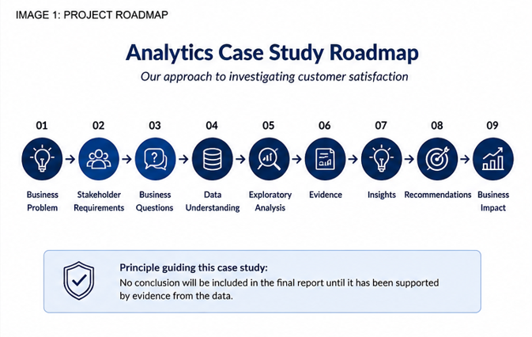

# Olist Customer Satisfaction Analytics Case Study

An end-to-end analytics case study investigating the operational drivers of customer satisfaction using SQL, Python and Tableau.

---

## Project Status

This case study is being developed as a structured five-chapter analytics investigation, following the same approach used in professional business analytics projects. Each chapter builds upon the previous one, progressing from business understanding through to evidence-based recommendations.

---

## Project Progress

- ✅ Chapter 1 – Business Understanding
- ✅ Chapter 2 – Understanding the Data Landscape
- ✅ Chapter 3 – Exploring the Evidence (Data Quality & Validation)
- ✅ Chapter 4 – Developing Insights
- ⬜ Chapter 5 – Delivering Recommendations

---

## Business Context

---

## Key Findings (Current)

The analysis completed so far has identified three operational factors that are strongly associated with customer satisfaction.

- Delivery performance shows the strongest relationship with customer review scores.
- Customer satisfaction varies across product categories, with several high-volume categories generating a disproportionate number of negative reviews.
- Customer dissatisfaction is concentrated among a relatively small group of sellers rather than being evenly distributed across the marketplace.

These findings will be consolidated into an executive dashboard and final business recommendations in Chapter 5.

---

## Case Study Structure

This case study is organised into five chapters, each representing a key stage of a real-world analytics project.

| Chapter | Focus |
|----------|-------|
| Chapter 1 | Business Understanding |
| Chapter 2 | Understanding the Data Landscape |
| Chapter 3 | Exploring the Evidence |
| Chapter 4 | Developing Insights |
| Chapter 5 | Delivering Recommendations |

---

## Project Methodology

The project follows a structured analytical methodology, beginning with business understanding before progressing through data discovery, data quality assessment, exploratory analysis and business recommendations.

Each stage builds upon evidence gathered during the previous stage to ensure that every conclusion is supported by data.

---

## Chapter 1 Deliverables

Completed:

- Business Problem Definition
- Stakeholder Analysis
- Business Question Matrix

---

## Chapter 2

### Understanding the Data Landscape

**Objective**

Develop a comprehensive understanding of the dataset before beginning any analytical work.

This chapter focuses on understanding the business role of each dataset, identifying relationships between the core entities and establishing the initial analytical framework that will guide the remainder of the project.

**Deliverables**

- Data Inventory
- Data Discovery Notes
- Initial Relationship Mapping
- KPI Framework

**Next Step**

Assess the quality of the data before beginning SQL exploration and analysis.

---

## Repository Structure

| Folder | Purpose |
|---------|----------|
| docs | Project documentation, planning and analytical framework |
| data | Raw datasets |
| sql | SQL exploration and business queries |
| notebooks | Python notebooks and analysis |
| dashboard | Tableau workbook and dashboard assets |
| images | Diagrams and project visuals |

---

## Guiding Principle

**No conclusion will appear in this case study until it has been supported by evidence from the data.**

---

## Chapter 3

### Exploring the Evidence

**Objective**

Validate the quality and reliability of the Olist dataset before beginning exploratory analysis.

This chapter focused on verifying that the data was complete, consistent and suitable for investigating the operational drivers of customer satisfaction. Rather than assuming the dataset was analysis-ready, each core table was assessed to ensure later findings would be supported by reliable evidence.

**Deliverables**

- Dataset completeness assessment
- Order status validation
- Historical date range validation
- Missing values investigation
- Customer review assessment
- Product category completeness assessment
- SQL data import documentation

**Outcome**

The validation confirmed that the dataset is suitable for exploratory analysis. Minor limitations were identified, documented and will be considered throughout the remainder of the project.

**Next Step**

Begin exploratory SQL analysis to investigate the operational and commercial factors influencing customer satisfaction.

---

## Chapter 4

### Developing Insights

**Objective**

Identify the operational and commercial factors most strongly associated with customer satisfaction using evidence derived from SQL analysis.

Rather than describing the data, this chapter investigates the relationships between delivery performance, product categories and seller performance to understand where customer dissatisfaction is concentrated.

**Deliverables**

- Delivery performance analysis
- Product category analysis
- Seller performance analysis
- Evidence-based business recommendations

**Key Findings**

- Customer satisfaction declines consistently as delivery delays increase.
- Certain product categories experience substantially poorer customer satisfaction than others.
- Customer dissatisfaction is concentrated among a relatively small number of sellers.

**Next Step**

Translate these findings into an executive Tableau dashboard and conclude the case study with evidence-based recommendations.
